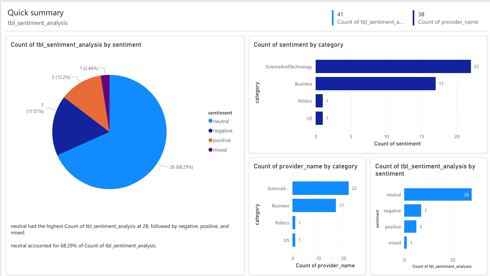
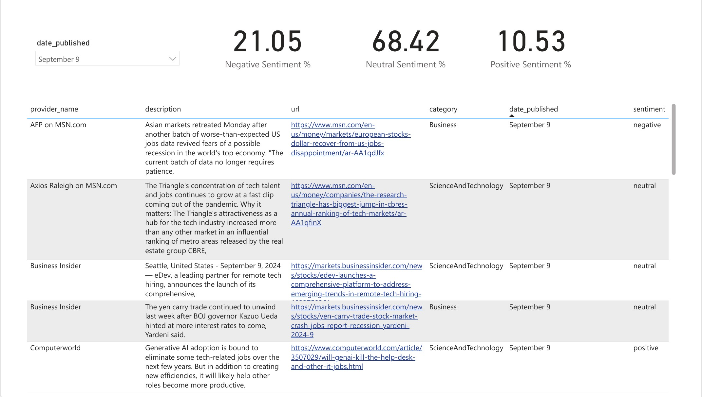

# Daily Job Market Sentiment Analysis Pipeline

A end-to-end data pipeline for analyzing job market sentiment using Microsoft Fabric, Azure Data Factory, and Power BI.

This pipeline performs the following tasks:
1. Ingests job listings from Bing API using Azure Data Factory
2. Processes raw JSON data into structured Delta tables using Synapse
3. Conducts sentiment analysis on job listings using a pre-trained ML model
4. Visualizes results in Power BI dashboards
5. Orchestrates daily pipeline runs and implements alert systems

## Dashboards

  
  

## Key Features

- Data ingestion from Bing API
- Data processing and transformation using Synapse
- Sentiment analysis using pre-trained ML models
- Real-time visualization with Power BI
- Automated pipeline orchestration
- Alert system integration with Microsoft Teams

## Technologies Used

- Microsoft Fabric
- Azure Data Factory
- Azure Synapse Analytics
- Power BI
- Data Activator
- Microsoft Teams (for alerts)

